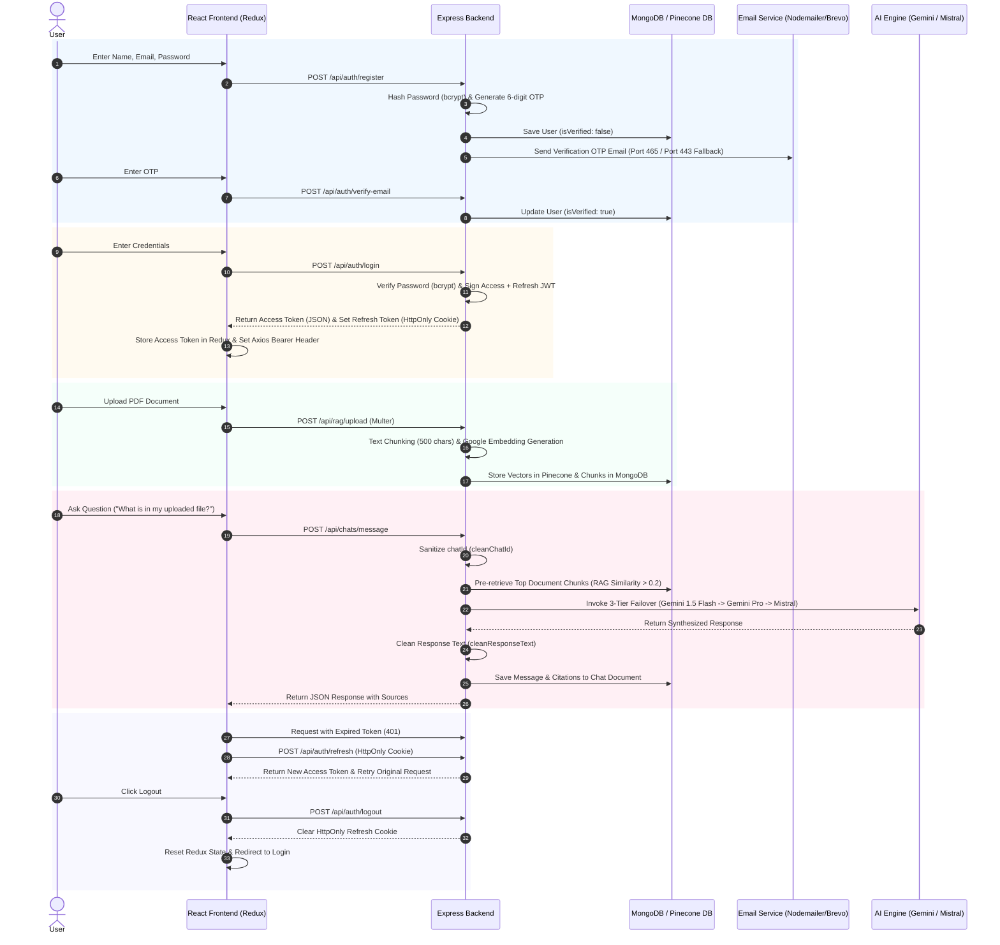

# 🔄 Zora.ai — Complete User Lifecycle Journey (Registration to Logout)

This guide documents the **Complete End-to-End Technical Flow** of a user's journey through Zora.ai.

---

---

## 1. 📝 Registration & Verification Phase

1. **User Sign Up (`POST /api/auth/register`):**
   - User inputs Name, Email, Password.
   - Backend checks `User.findOne({ email })`.
   - Generates a 6-digit OTP using `crypto.randomInt(100000, 999999)`.
   - Hashes password with `bcryptjs` (salt 10) and saves user with `isVerified: false`.
   - Calls `sendVerificationEmail()`. If SMTP Port 465 is blocked by cloud provider (Render), it automatically fails over to **Brevo HTTPS REST API on Port 443**.
2. **Email OTP Verification (`POST /api/auth/verify-email`):**
   - User enters OTP on Frontend.
   - Backend verifies OTP & expiration timestamp $\rightarrow$ Updates user in MongoDB to `isVerified: true`.

---

## 2. 🔑 Login & Token Lifecycle Phase

1. **Authentication (`POST /api/auth/login`):**
   - User enters Email & Password.
   - Backend checks password via `bcrypt.compare()`.
   - Generates two JWT tokens:
     - **Access Token:** Short-lived JWT (e.g. 15 mins) containing `{ id, email }`.
     - **Refresh Token:** Long-lived JWT (e.g. 7 days).
   - Sets Refresh Token in **HttpOnly Cookie** (`res.cookie('refreshToken', token, { httpOnly: true, secure: true })`).
   - Returns Access Token in JSON body to Frontend.
2. **Frontend State Hydration:**
   - Redux stores Access Token.
   - Axios sets default header: `axios.defaults.headers.common['Authorization'] = 'Bearer ' + accessToken`.

---

## 3. 📄 Document Upload & RAG Ingestion Phase

1. **File Upload (`POST /api/rag/upload`):**
   - User uploads PDF/TXT via Knowledge Base modal.
   - `Multer` handles in-memory file buffer (`req.file`).
2. **Vector Chunking & Embedding:**
   - Text is split into 500-character segments with 50-character overlaps using `chunking.service.js`.
   - `embedding.service.js` generates 768-dimensional dense vectors using **Google Generative AI Embeddings**.
3. **Dual Storage:**
   - Vectors are stored in **Pinecone Vector Database**.
   - Text chunks and metadata are stored in MongoDB `ChunkModel` for high-speed fallback.

---

## 4. 💬 Query Execution & Single-Pass AI Processing

1. **Message Submission (`POST /api/chats/message`):**
   - User types a query or clicks a suggestion.
   - `chat.controller.js` runs `cleanChatId()` to sanitize string `"null"` / `"undefined"` into real `null`, avoiding BSON `CastError 500` crashes.
2. **Deterministic Context Pre-Retrieval:**
   - **RAG Retrieval:** If user has uploaded files, `retrieval.service.js` converts query to a vector embedding, performs Cosine Similarity search, and fetches top matching chunks ($score > 0.2$).
   - **Web Search Retrieval:** For general queries, Tavily REST API pre-retrieves live 2026 web results.
3. **3-Tier Failover AI Generation:**
   - Single-pass system prompt assembled with Live IST Clock (`Asia/Kolkata`).
   - Invocations iterate over provider pipeline: `Gemini 1.5 Flash` $\rightarrow$ `Gemini 1.5 Pro` $\rightarrow$ `Mistral AI`.
   - If Tier 1 hits HTTP 429 Quota Exceeded, system fails over to Mistral AI in milliseconds.
4. **Sanitization & Response Delivery:**
   - `cleanResponseText()` strips internal Gemini pipe tokens and pseudo-XML tags.
   - Message and dynamic sources array (URLs, page titles, scores) are saved to MongoDB `Chat` document and returned to Frontend.

---

## 5. 🔄 Silent Token Refresh & Logout Phase

1. **Silent Refresh Interceptor (`/api/auth/refresh`):**
   - If Access Token expires during active session, Axios interceptor catches HTTP 401.
   - Automatically calls `/api/auth/refresh` passing HttpOnly cookie.
   - Receives new Access Token and retries original request without logging out user.
2. **Logout (`POST /api/auth/logout`):**
   - User clicks Logout button.
   - Backend clears HttpOnly Refresh Cookie (`res.clearCookie('refreshToken')`).
   - Frontend clears Redux state and redirects to Login page.
